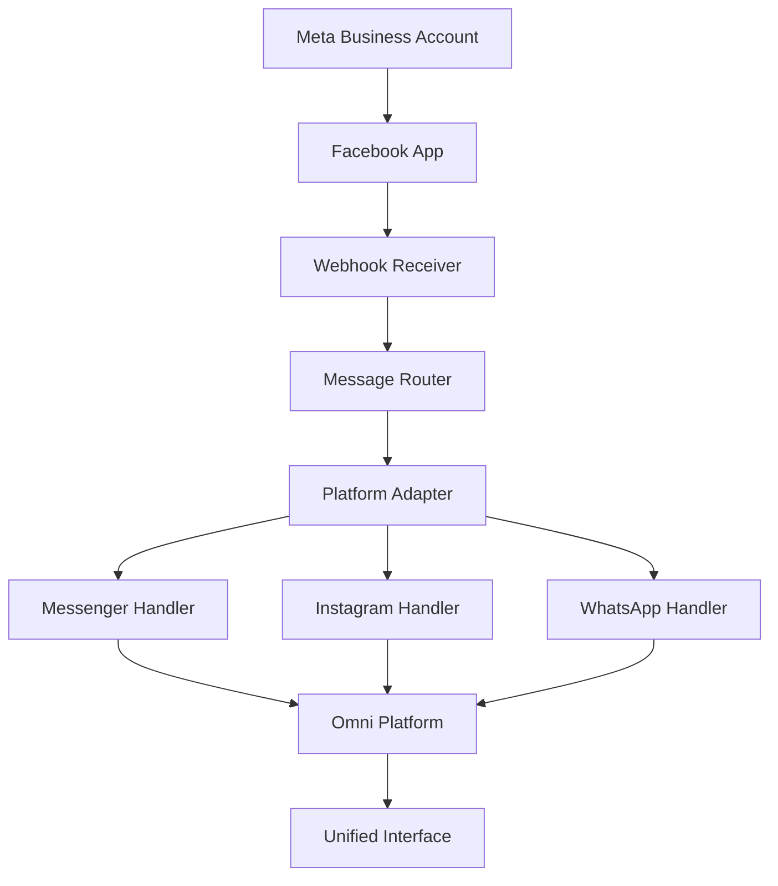

# Facebook Ecosystem Integration Guide

> **Not live (2026).** Messenger / Instagram are not on the Omni `src/server.js` webhook path. Live channels: LINE + WhatsApp (Twilio). See [README.md](README.md).

**Platforms**: Facebook Messenger, WhatsApp, Instagram  
**API Version**: Graph API v18.0+  
**Status**: Design notes only — not the running inbox  

---

## Overview

This guide covers integrating **Facebook, Instagram, and WhatsApp** as a unified ecosystem using Facebook's Graph API and Meta Business Suite.

### Why Unified Integration?

All three platforms are owned by Meta and share:
- ✅ Unified authentication (Meta Business Account)
- ✅ Shared infrastructure via Graph API
- ✅ Consistent webhook handling
- ✅ Integrated media storage
- ✅ Unified inbox management

---

## Prerequisites

### 1. Meta Business Account Setup

```bash
# Required
- Meta Business Account (free)
- Facebook Developer Account
- Facebook App created
- Business verification (for production)
```

### 2. Platform-Specific Requirements

| Platform | Account Type | Annual Cost | Verification |
|----------|-------------|-------------|--------------|
| **Facebook Messenger** | Business Page | Free | ID + Phone |
| **Instagram Messaging** | Business Account | Free | Linked FB |
| **WhatsApp Business** | Business API | Paid* | Business License |

\* WhatsApp via BSP (Twilio/MessageBird): $0.005-$0.01 per message

---

## Architecture Overview



---

## Step-by-Step Integration

### Phase 1: Facebook App Setup (1-2 days)

#### 1. Create Facebook App
```bash
# Go to https://developers.facebook.com/apps
# Click "Create App" → "Business" type
# Name: "Omni Platform Messenger"
```

#### 2. Configure Webhook
```javascript
// Add Product: "Messenger"
// Set Webhook URL: https://yourdomain.com/webhook/messenger
// Verify Token: "your_webhook_verify_token"
// Subscribe to: messages, message_postbacks, messaging_optins
```

#### 3. Generate Access Tokens
```bash
# Get Page Access Token for Messenger
# Get Instagram Access Token for Instagram
# Configure App Secret for webhook verification
```

---

### Phase 2: Implementation (3-5 days)

#### 1. Create Unified Webhook Handler

**File**: `src/services/facebookWebhookHandler.js`

```javascript
const axios = require('axios');
const crypto = require('crypto');

class FacebookWebhookHandler {
  constructor(io) {
    this.io = io;
    this.appSecret = process.env.FACEBOOK_APP_SECRET;
    this.pageAccessToken = process.env.FACEBOOK_PAGE_ACCESS_TOKEN;
  }

  // Verify webhook signature
  verifyWebhook(req, res) {
    const signature = req.headers['x-hub-signature-256'];
    const payload = JSON.stringify(req.body);
    const hash = crypto.createHmac('sha256', this.appSecret)
      .update(payload)
      .digest('hex');
    
    if (hash === signature.split('sha256=')[1]) {
      res.status(200).send(req.query['hub.challenge']);
    } else {
      res.sendStatus(403);
    }
  }

  // Handle incoming messages from all platforms
  async handleMessage(platform, data) {
    try {
      const { sender, message, timestamp } = data;
      
      // Determine platform
      let platformType = 'facebook';
      if (platform === 'instagram') {
        platformType = 'instagram';
      } else if (data.platform_type === 'whatsapp') {
        platformType = 'whatsapp';
      }

      // Get or create user
      const user = await this.getOrCreateFacebookUser(
        platformType, 
        sender.id,
        sender.name || sender.username
      );

      // Get or create conversation
      const conversation = await this.getOrCreateConversation(
        user,
        platformType
      );

      // Store message
      const messageToStore = await this.storeMessage({
        conversationId: conversation.id,
        userId: user.id,
        content: message.text,
        senderName: user.name,
        platform: platformType,
        platformMessageId: message.mid,
        timestamp: timestamp
      });

      // Emit real-time event
      this.io.emit('new_message', {
        id: messageToStore.id,
        conversation_id: conversation.id,
        sender_name: user.name,
        sender_id: user.id,
        content: message.text,
        platform: platformType,
        timestamp: timestamp
      });

      return { success: true, messageId: messageToStore.id };
    } catch (error) {
      console.error(`Error handling ${platform} message:`, error);
      throw error;
    }
  }

  // Get or create user across all Facebook platforms
  async getOrCreateFacebookUser(platform, userId, userName) {
    // Implementation similar to LINE/WhatsApp
    const existingUser = await dataStorage.getUserByPlatformId(platform, userId);
    
    if (existingUser) {
      return existingUser;
    }

    // Get profile from Graph API
    let profileUrl = null;
    if (platform === 'facebook') {
      const response = await axios.get(
        `https://graph.facebook.com/v18.0/${userId}`,
        {
          params: {
            fields: 'name,picture',
            access_token: this.pageAccessToken
          }
        }
      );
      profileUrl = response.data.picture?.data?.url;
    }

    const newUser = {
      id: `user_${platform}_${userId}`,
      platform_id: userId,
      platform: platform,
      name: userName,
      profile_picture_url: profileUrl,
      status: 'active',
      created_at: new Date().toISOString()
    };

    return await dataStorage.saveUser(newUser);
  }

  // Store message
  async storeMessage(messageData) {
    return await dataStorage.saveMessage({
      id: `msg_${Date.now()}_${Math.random().toString(36).substr(2, 9)}`,
      conversation_id: messageData.conversationId,
      sender_id: messageData.userId,
      sender_name: messageData.senderName,
      sender_type: 'user',
      message_type: 'text',
      content: messageData.content,
      platform: messageData.platform,
      platform_message_id: messageData.platformMessageId,
      timestamp: messageData.timestamp,
      created_at: messageData.timestamp
    });
  }
}

module.exports = FacebookWebhookHandler;
```

#### 2. Add Routes to server.js

```javascript
// Add these routes after line ~150
const FacebookWebhookHandler = require('./services/facebookWebhookHandler');
const facebookHandler = new FacebookWebhookHandler(this.io);

// Facebook Messenger webhook
this.app.post('/webhook/messenger', async (req, res) => {
  const body = req.body;
  
  if (body.object === 'page') {
    for (const entry of body.entry) {
      const webhookEvent = entry.messaging[0];
      await facebookHandler.handleMessage('facebook', {
        sender: { id: webhookEvent.sender.id },
        message: { text: webhookEvent.message.text, mid: webhookEvent.message.mid },
        timestamp: webhookEvent.timestamp
      });
    }
    res.status(200).send('EVENT_RECEIVED');
  } else {
    res.sendStatus(404);
  }
});

// Instagram webhook
this.app.post('/webhook/instagram', async (req, res) => {
  const body = req.body;
  
  if (body.object === 'instagram') {
    for (const entry of body.entry) {
      for (const event of entry.messaging) {
        await facebookHandler.handleMessage('instagram', {
          sender: { id: event.sender.id },
          message: { text: event.message.text },
          timestamp: event.time
        });
      }
    }
    res.status(200).send('EVENT_RECEIVED');
  } else {
    res.sendStatus(404);
  }
});

// Verification endpoint
this.app.get('/webhook/messenger', (req, res) => {
  facebookHandler.verifyWebhook(req, res);
});
this.app.get('/webhook/instagram', (req, res) => {
  facebookHandler.verifyWebhook(req, res);
});
```

#### 3. Send Messages to Facebook

```javascript
// src/adapters/FacebookAdapter.js
class FacebookAdapter {
  constructor(accessToken) {
    this.accessToken = accessToken;
    this.graphApiUrl = 'https://graph.facebook.com/v18.0';
  }

  async sendMessage(recipientId, message) {
    const response = await axios.post(
      `${this.graphApiUrl}/me/messages`,
      {
        recipient: { id: recipientId },
        message: { text: message },
        messaging_type: 'RESPONSE'
      },
      {
        params: { access_token: this.accessToken }
      }
    );
    return response.data;
  }

  async sendToInstagram(recipientId, message) {
    // Instagram uses same API with different endpoint
    const response = await axios.post(
      `${this.graphApiUrl}/me/messages`,
      {
        recipient: { id: recipientId },
        message: { text: message }
      },
      {
        params: { 
          access_token: this.pageAccessToken,
          recipient_type: 'instagram'
        }
      }
    );
    return response.data;
  }
}
```

---

## Configuration (.env)

```bash
# Facebook/Instagram/Messenger
FACEBOOK_APP_ID=your_app_id
FACEBOOK_APP_SECRET=your_app_secret
FACEBOOK_PAGE_ACCESS_TOKEN=your_page_token
FACEBOOK_WEBHOOK_VERIFY_TOKEN=your_verify_token

# WhatsApp (via Twilio - keep existing)
TWILIO_WHATSAPP_FROM=whatsapp:+14155238886
TWILIO_ACCOUNT_SID=your_sid
TWILIO_AUTH_TOKEN=your_token

# Already using Twilio WhatsApp, can keep or migrate to Meta WhatsApp
```

---

## Message Flow

### Receiving Messages
```
User sends message → Facebook Graph API → Your Webhook 
→ Parse platform (Messenger/Instagram) → Store in DB 
→ Emit Socket.IO → Real-time display in Omni
```

### Sending Messages
```
Omni sends message → FacebookAdapter → Graph API 
→ Messages delivered to user
```

---

## Platform Comparison

| Feature | Messenger | Instagram | WhatsApp |
|---------|-----------|-----------|----------|
| **API** | Graph API | Graph API | Business API |
| **Webhook** | ✅ Yes | ✅ Yes | ✅ Yes |
| **Media** | ✅ All types | ✅ All types | ✅ All types |
| **Templates** | ✅ Yes | ✅ Yes | ✅ Yes (approval) |
| **Read Receipts** | ✅ Yes | ✅ Yes | ✅ Yes |
| **Typing Indicator** | ✅ Yes | ✅ Yes | ✅ No |
| **Profile Pictures** | ✅ Yes | ✅ Yes | ⚠️ Limited |

---

## Testing

### 1. Local Testing with ngrok
```bash
# Start ngrok
ngrok http 3000

# Update Facebook App webhook URL to ngrok URL
https://your-ngrok-url.ngrok.io/webhook/messenger
```

### 2. Test Webhooks
```bash
# Test Messenger
curl -X POST http://localhost:3000/webhook/messenger \
  -H "Content-Type: application/json" \
  -d '{"object":"page","entry":[...]}'

# Test Instagram  
curl -X POST http://localhost:3000/webhook/instagram \
  -H "Content-Type: application/json" \
  -d '{"object":"instagram","entry":[...]}'
```

---

## Migration from Current WhatsApp

### Option 1: Keep Twilio WhatsApp
- ✅ Already working
- ✅ No changes needed
- ⚠️ Separate from Facebook ecosystem

### Option 2: Migrate to Meta WhatsApp (Recommended for Unified)
**Migration Steps**:
1. Apply for Meta WhatsApp Business API
2. Get WhatsApp Business Account Number
3. Configure in Meta Business Manager
4. Update webhook to use Graph API
5. Re-test all WhatsApp flows

**Benefits**:
- ✅ Unified inbox (Messenger + Instagram + WhatsApp)
- ✅ Lower costs (Meta pricing)
- ✅ Better analytics in Meta Business Suite

---

## Timeline & Cost

| Task | Duration | Cost |
|------|----------|------|
| Facebook App Setup | 1 day | Free |
| Messenger Integration | 2-3 days | Free |
| Instagram Integration | 2-3 days | Free |
| Testing & Debugging | 2-3 days | - |
| WhatsApp Migration (optional) | 3-5 days | Business verification fees |
| **Total** | **1-2 weeks** | **~$0-100** |

---

## Security Considerations

1. **Webhook Verification**: Always verify HMAC signature
2. **Access Token Security**: Rotate tokens regularly
3. **Page Permissions**: Request minimum required permissions
4. **Rate Limits**: Respect Meta's API limits
5. **Data Privacy**: Comply with GDPR/CCPA

---

## Troubleshooting

### Common Issues

**Issue**: Webhook verification fails
- **Solution**: Check verify token matches exactly

**Issue**: Messages not appearing
- **Solution**: Verify access token has correct permissions

**Issue**: Rate limit errors  
- **Solution**: Implement exponential backoff retry

**Issue**: Media not loading
- **Solution**: Use temporary signed URLs with timeout

---

## Next Steps

1. ✅ Set up Facebook Developer account
2. ✅ Create Facebook App
3. ✅ Configure webhooks
4. ✅ Implement webhook handlers
5. ✅ Add FacebookAdapter
6. ✅ Test with ngrok
7. ✅ Deploy to production
8. ✅ Monitor webhook events

---

## Resources

- [Facebook Graph API Docs](https://developers.facebook.com/docs/graph-api)
- [Messenger Platform](https://developers.facebook.com/docs/messenger-platform)
- [Instagram Messaging](https://developers.facebook.com/docs/instagram-api/messaging)
- [WhatsApp Business API](https://developers.facebook.com/docs/whatsapp)

---

## Support

For integration help, refer to:
- `DEVELOPMENT.md` - Development workflow
- `API.md` - API reference
- `PLATFORM_INTEGRATION.md` - Integration patterns

